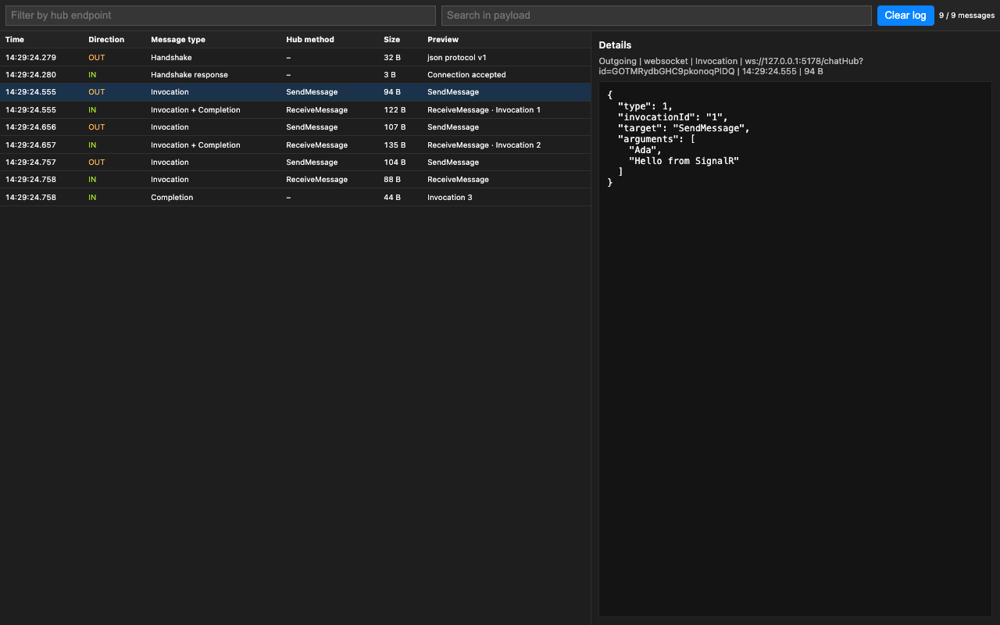
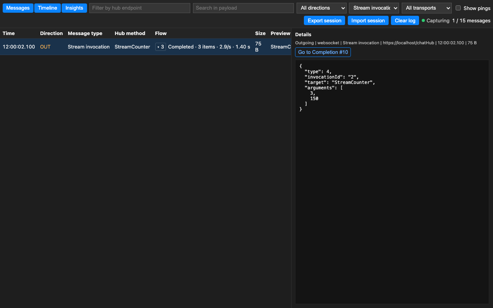

# SignalR Inspector

[](https://github.com/jakubgrzywaczewski/signalr-devtools/actions/workflows/ci.yml)

SignalR Inspector is a Chromium DevTools extension for Google Chrome and Microsoft Edge that turns
ASP.NET Core SignalR traffic into a focused, searchable message log.



A browser's Network panel can display WebSocket frames, but a busy application quickly becomes
hard to follow: hub traffic is mixed with other requests, payloads are disconnected from their
direction and endpoint, and comparing messages requires repeatedly opening individual frames.
SignalR Inspector was created to keep that debugging loop in one place.

## What it provides

- automatic SignalR detection from the protocol handshake, regardless of the hub URL;
- incoming and outgoing messages with timestamps, endpoint, size, and payload preview;
- SignalR message types, hub methods, invocation IDs, completions, and errors;
- WebSocket, Server-Sent Events, and HTTP Long Polling transport visibility;
- endpoint and payload filtering;
- formatted JSON and MessagePack payloads, with original Base64 retained for binary messages;
- bounded per-tab, in-memory logs with a 500-message limit;
- no analytics, remote services, or persistence.

## Browser support

SignalR Inspector is end-to-end tested with current stable versions of:

- Google Chrome;
- Microsoft Edge.

Both browsers use the same Manifest V3 package and extension APIs. Firefox and Safari are not
currently supported.

## Try it in five minutes

Requirements: Google Chrome or Microsoft Edge, Node.js 22 or newer, and the .NET 10 SDK.

```bash
git clone https://github.com/jakubgrzywaczewski/signalr-devtools.git
cd signalr-devtools/signalr-inspector
npm ci
npm test
```

1. Open `chrome://extensions` in Chrome or `edge://extensions` in Edge.
2. Enable **Developer mode**, choose **Load unpacked**, and select `signalr-inspector`.
3. Start the included sample:

   ```bash
   dotnet run --project samples/SignalR.Sample
   ```

4. Open the sample URL in the same browser.
5. Open DevTools and select **SignalR Inspector**. Opening DevTools starts passive Long Polling
   observation for the inspected tab so negotiation and HTTP requests can be correlated from the
   beginning. WebSocket and SSE instrumentation remains off until explicit activation.
6. Click the SignalR Inspector toolbar icon. The extension activates page instrumentation only for
   that tab and reloads the page. Click the icon again to disable instrumentation and reload the
   tab without it.
7. Use the **WebSockets** or **Long Polling** link and send a message from the sample page.
8. Select any captured row to inspect the full JSON protocol frame.

## SignalR-aware inspection

SignalR Inspector understands the JSON and MessagePack Hub Protocol encodings. It distinguishes
handshakes, invocations, stream items, completions, cancellations, pings, closes, acknowledgements,
and sequences. Hub targets such as `SendMessage` and `ReceiveMessage` are shown directly in the
table. Selected MessagePack payloads are decoded to readable JSON while retaining their original
Base64 for low-level comparison.



## Official SignalR references

SignalR Inspector is an independent developer tool built against the public ASP.NET Core SignalR
documentation and protocol:

- [ASP.NET Core SignalR overview](https://learn.microsoft.com/aspnet/core/signalr/introduction);
- [ASP.NET Core SignalR JavaScript client](https://learn.microsoft.com/aspnet/core/signalr/javascript-client);
- [ASP.NET Core SignalR MessagePack protocol](https://learn.microsoft.com/aspnet/core/signalr/messagepackhubprotocol);
- [SignalR Hub Protocol specification](https://github.com/dotnet/aspnetcore/blob/main/src/SignalR/docs/specs/HubProtocol.md);
- [SignalR Transport Protocol specification](https://github.com/dotnet/aspnetcore/blob/main/src/SignalR/docs/specs/TransportProtocols.md);
- [Chrome DevTools Network API](https://developer.chrome.com/docs/extensions/reference/api/devtools/network);
- [ASP.NET Core source repository](https://github.com/dotnet/aspnetcore).

This project is not affiliated with or endorsed by Microsoft.

## How it works

```text
WebSocket / EventSource ──→ detection in the page's MAIN world ─┐
                                                               │
Long Polling HTTP ──→ read-only DevTools Network observer ─────┤
                                                               ▼
              validation → extension service worker → DevTools panel
                              │
                              └─ in-memory, per-tab ring buffer
```

The extension does not guess based on paths such as `/signalr`, `/chatHub`, `/_blazor`, or
`/grpc`. A WebSocket is classified as SignalR when it sends the standard protocol handshake or
a valid JSON protocol frame. Long Polling requests are correlated through the negotiation
response, connection token, HTTP method, and SignalR frames. Connection and access tokens are
removed from displayed endpoints. This also supports applications with custom hub routes.

## Repository layout

| Path | Purpose |
| --- | --- |
| [`signalr-inspector`](signalr-inspector) | Chromium extension, packaging, and tests |
| [`samples/SignalR.Sample`](samples/SignalR.Sample) | Dependency-free .NET 10 SignalR demo |
| [`tools/msgpack-fixtures`](tools/msgpack-fixtures) | Official .NET MessagePack golden-fixture generator |
| [`.github/workflows/ci.yml`](.github/workflows/ci.yml) | Node and .NET continuous integration |
| [`CHANGELOG.md`](CHANGELOG.md) | Version-by-version project history |
| [`docs/BROWSER_STORES.md`](docs/BROWSER_STORES.md) | Store assets, release copy, and submission guidance |

## Current scope

SignalR Inspector currently captures:

- WebSocket traffic using the JSON or MessagePack protocol after a detectable handshake, including
  field-level decoding of standard MessagePack hub messages;
- incoming Server-Sent Events JSON protocol messages;
- incoming and outgoing Long Polling JSON protocol messages, including negotiation correlation,
  empty-poll handling, and connection cleanup.

It does not yet capture outgoing SSE HTTP posts or WebSocket or SSE traffic created inside iframes
or Web Workers. Non-SignalR binary payloads and malformed or incomplete MessagePack frames fall
back to Base64 and hex previews. Page code can detect or bypass the WebSocket and EventSource
wrappers, so the extension is a diagnostics aid rather than a security monitor. The extension is
read-only and never modifies application traffic.

## Inspect MessagePack traffic

The extension decodes the standard SignalR MessagePack framing automatically after the normal JSON
handshake selects `messagepack`. No extension setting or additional browser permission is needed.
Configure the application with the official protocol implementation:

```csharp
builder.Services.AddSignalR().AddMessagePackProtocol();
```

```javascript
const connection = new signalR.HubConnectionBuilder()
  .withUrl("/chatHub")
  .withHubProtocol(new signalR.protocols.msgpack.MessagePackHubProtocol())
  .build();
```

The server uses the `Microsoft.AspNetCore.SignalR.Protocols.MessagePack` NuGet package. The browser
client uses `@microsoft/signalr-protocol-msgpack`. The inspector decodes captured bytes for display
only; it does not deserialize them into application types or alter the connection.

## Browser store assets

The checked-in screenshots were produced from the real .NET sample and extension pipeline. Their
dimensions and intended Chrome Web Store and Microsoft Edge Add-ons slots are documented in
[`docs/BROWSER_STORES.md`](docs/BROWSER_STORES.md). The local generation harness is excluded from
source control because it is not part of the extension or its automated verification.

## Privacy and security

SignalR Inspector does not request access to every website. WebSocket and SSE instrumentation is
installed only after the developer clicks the toolbar icon and grants temporary `activeTab`
access. Long Polling is observed through the browser's read-only DevTools Network API for the tab
currently being inspected. Captured data remains in extension memory and is removed when the tab
closes, the service worker restarts, or the log is cleared. Connection and common access-token
parameters are removed from all displayed endpoints before captured messages are stored, and
payloads larger than 256 KiB are not retained.

See [PRIVACY.md](signalr-inspector/PRIVACY.md), [SECURITY.md](SECURITY.md), and
[CONTRIBUTING.md](CONTRIBUTING.md).

## Governance

[Jakub Grzywaczewski](https://github.com/jakubgrzywaczewski) is the sole maintainer and code
owner. External contributions are welcome through pull requests, but only the maintainer has
write and merge access to this repository.

## License

Released under the [MIT License](LICENSE).
