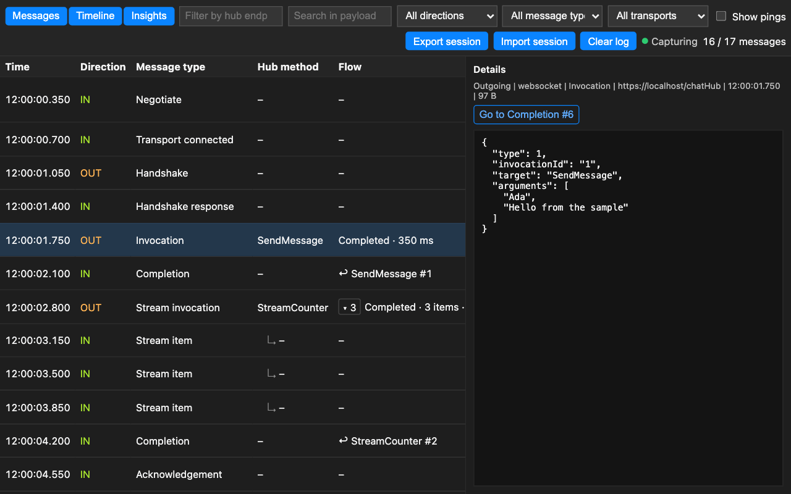
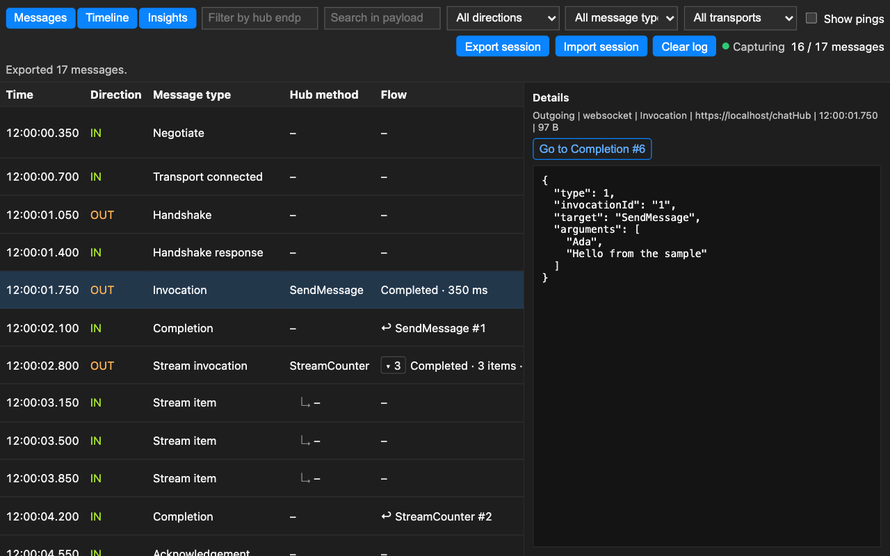

# SignalR to nie tylko ramka WebSocket

## Jak zbudowałem panel Chrome DevTools, którego brakowało mi przy debugowaniu aplikacji real-time


Niedawno wróciłem do małego rozszerzenia przeglądarki, które napisałem jakiś czas temu.

Rozszerzenie miało własny panel w Chrome DevTools, tabelę z wiadomościami przychodzącymi
i wychodzącymi, filtry i widok szczegółów. Działało wystarczająco dobrze dla aplikacji, którą
wtedy debugowałem. Jak wiele narzędzi wewnętrznych, urodziło się z bardzo konkretnej irytacji,
rozwiązało konkretny problem, a potem cicho czekało w repozytorium.

Kiedy otworzyłem ten kod ponownie z zamiarem publikacji, spodziewałem się głównie prac
porządkowych: aktualizacji zależności, poprawy README, dodania sample'a, może kilku zrzutów
ekranu.

Zamiast tego znalazłem znacznie ciekawsze pytanie:

> Co to właściwie znaczy: inspekcjonować ruch SignalR?

Czy wystarczy wyświetlać ramki WebSocket? Czy inspektor powinien rozpoznawać URL taki jak
`/notificationsHub` albo `/chatHub`? Czy SignalR to po prostu etykieta przyklejona do połączenia
WebSocket, czy może protokół ukryty poziom wyżej nad transportem?

Ta różnica brzmi akademicko — dopóki nie spróbujemy zbudować narzędzia do debugowania. Wtedy
staje się całą architekturą.

W tym artykule „SignalR” oznacza ASP.NET Core SignalR i jego Hub Protocol, nie starszą
implementację ASP.NET SignalR.

## Problem: Chrome pokazuje transport, nie konwersację

Chrome DevTools ma przecież panel Network. Kiedy aplikacja nawiązuje połączenie WebSocket,
możemy je wybrać i oglądać wiadomości płynące w obu kierunkach.

Dla prostej aplikacji to może wystarczyć.

Dla prawdziwej aplikacji SignalR ten widok szybko przestaje pomagać. Widzimy ramki takie jak:

```text
{"type":1,"invocationId":"1","target":"SendMessage","arguments":["Ada","Hello"]}\u001e
```

Dane są, ale ich znaczenie pozostaje domyślne.

Deweloper wciąż musi pamiętać, że:

- `type: 1` oznacza invocation,
- `target` to metoda huba,
- `invocationId` łączy wywołanie z jego completion,
- kilka wiadomości protokołu może dzielić jedną ramkę transportu,
- separator rekordów kończy wiadomości JSON Hub Protocol,
- `{}` to udana odpowiedź handshake,
- `type: 6` to ping,
- `type: 7` zamyka połączenie.

Chrome pokazuje drut. Konwersację rekonstruuje deweloper.

To niekoniecznie wada Chrome. Panel Network jest instrumentem ogólnego przeznaczenia. Nie może
zamienić każdego protokołu aplikacyjnego w pełnoprawny model debugowania. Ale dokładnie tu
zaczynają być użyteczne wyspecjalizowane narzędzia deweloperskie.

Ciekawym punktem odniesienia jest Firefox. Jego inspektor WebSocket jawnie wspiera kilka
protokołów wyższego poziomu, w tym SignalR, i potrafi pokazać sparsowane payloady jako
rozwijane dane [4]. Chrome ma znakomitą widoczność niskopoziomową, ale interpretację SignalR
zostawia w większym stopniu deweloperowi.

Ta luka stała się powodem powstania SignalR Inspector.


## Mój pierwszy błąd: patrzenie na endpoint zamiast na protokół

Pierwsza wersja rozszerzenia klasyfikowała ruch po URL-u. Jeśli endpoint zawierał `/grpc`,
rozszerzenie zakładało, że to ruch, który chcę oglądać.

Działało — dla jednej aplikacji.

Było też koncepcyjnie błędne.

SignalR i gRPC to różne technologie. Co ważniejsze, hub SignalR może używać praktycznie
dowolnej trasy:

```csharp
app.MapHub<ChatHub>("/chatHub");
```

Inna aplikacja może wystawić `/notifications`, `/events` albo trasę zdefiniowaną wewnętrzną
konwencją.

Inspektor rozpoznający tylko jedną ścieżkę nie jest inspektorem protokołu. Jest filtrem
specyficznym dla aplikacji noszącym generyczną nazwę.

To rozróżnienie przypomniało mi znany architektoniczny smell: identyfikowanie pojęcia po tym,
gdzie akurat je znaleźliśmy, zamiast po tym, czym naprawdę jest. To jak założenie, że każda
odpowiedź JSON pod `/api` to REST, albo że każde długotrwałe żądanie HTTP to streaming.

URL-e to decyzje wdrożeniowe. Handshake SignalR to dowód protokołowy.

## Od heurystyk URL do detekcji protokołu

Po ustanowieniu transportu SignalR rozpoczyna konwersację Hub Protocol od handshake'u.
Handshake nie wybiera WebSockets, Server-Sent Events ani Long Pollingu; ten wybór już się
dokonał. Wybiera format wiadomości używany nad transportem — JSON albo MessagePack [1].

Dla JSON Hub Protocol klient wysyła handshake podobny do:

```json
{"protocol":"json","version":1}
```

Wiadomość kończy znak separatora rekordów ASCII (`0x1e`). Po zakończeniu handshake'u
wiadomości huba niosą numeryczne typy zdefiniowane przez protokół.

To daje rozszerzeniu znacznie mocniejszą strategię detekcji:

1. Obserwuj strumień WebSocket lub Server-Sent Events.
2. Buforuj niewielką liczbę początkowych wiadomości.
3. Szukaj handshake'u SignalR albo wiarygodnej wiadomości JSON Hub Protocol.
4. Dopiero po detekcji opublikuj zbuforowane wiadomości do rozszerzenia.
5. Ignoruj niezwiązany ruch WebSocket.

W uproszczeniu:

```javascript
function isSignalRHandshake(data) {
  if (typeof data !== 'string') {
    return false;
  }

  const firstRecord = data.split('\u001e', 1)[0];

  try {
    const message = JSON.parse(firstRecord);
    return (
      typeof message?.protocol === 'string' &&
      Number.isInteger(message.version)
    );
  } catch {
    return false;
  }
}
```

Rozszerzenie nie musi już wiedzieć, czy hub nazywa się `/chatHub`, `/_blazor`, czy
`/ta-nazwa-zmieni-sie-w-nastepnym-sprincie`.

Rozpoznaje SignalR, bo SignalR sam się przedstawia.

Jest jeden transport, którego ta strategia w ogóle nie widzi: HTTP Long Polling nie ma
strumienia na poziomie strony, który można by opakować. Ta historia wymaga innego punktu
obserwacji i wrócę do niej po opisaniu architektury.

## Rozszerzenie przeglądarki to miniaturowy system rozproszony

Na pierwszy rzut oka rozszerzenie DevTools to kilka plików JavaScript i manifest.

Architektonicznie jest bliższe małemu systemowi rozproszonemu działającemu wewnątrz
przeglądarki.

SignalR Inspector ma cztery istotne obszary wykonania:

```text
Strona aplikacji (świat MAIN)
        ↓
Content script (świat ISOLATED)
        ↓
Service worker rozszerzenia
        ↓
Panel DevTools
```

Każda granica istnieje z jakiegoś powodu.

### Warstwa 1: świat strony — blisko ruchu, daleko od zaufania

Żeby obserwować wywołania `WebSocket.send`, rozszerzenie musi zinstrumentować konstruktor
używany przez aplikację. Izolowany content script nie może bezpośrednio podmienić globala
JavaScript należącego do strony.

Manifest V3 pozwala content scriptom działać w świecie `MAIN` [2]. Wczesna wersja deklarowała
ten skrypt statycznie dla `<all_urls>`, co oznaczało, że rozszerzenie instrumentowało każdą
stronę przez cały czas. SignalR Inspector 1.0 to odwraca: nic nie jest wstrzykiwane, dopóki deweloper
nie kliknie ikony na pasku narzędzi na karcie, którą chce obserwować. Kliknięcie przyznaje
tymczasowy dostęp `activeTab`, a rozszerzenie rejestruje swoje skrypty dynamicznie, ograniczone
do dokładnego hosta tej karty:

```javascript
await chrome.scripting.registerContentScripts([
  {
    id: `signalr-main-${tabId}`,
    js: ['injected.js'],
    matches: [`${url.protocol}//${url.hostname}/*`],
    runAt: 'document_start',
    world: 'MAIN',
    persistAcrossSessions: false,
  },
]);
```

`document_start` ma znaczenie. Jeśli aplikacja przechwyci natywny konstruktor `WebSocket`,
zanim rozszerzenie go opakuje, inspektor nie zobaczy połączenia. Ponieważ aktywacja następuje
na stronie już załadowanej, rozszerzenie przeładowuje kartę po rejestracji, żeby handshake był
obserwowany od pierwszej ramki. Ponowne kliknięcie ikony wyrejestrowuje instrumentację
i przeładowuje stronę bez niej — aktywacja to prawdziwy przełącznik per-tab, nie jednokierunkowa
dźwignia.

Świat MAIN rozwiązuje problem widoczności, ale tworzy problem zaufania. Kod w tym świecie
dzieli środowisko ze stroną. Strona może go podejrzeć, zakłócić albo imitować wiadomości, które
emituje.

Instrumentacja musi więc pozostać celowo pozbawiona przywilejów.

### Warstwa 2: izolowany content script — celnik

Content script odbiera wiadomości przekraczające granicę strona → rozszerzenie. Sprawdzanie
`event.source` i `event.origin` jest przydatne, ale nie uwierzytelnia strony wobec niej samej.
Strona nadal potrafi wyprodukować poprawnie ukształtowany `window.postMessage`.

Most musi się więc zachowywać jak API wystawione na niezaufane wejście:

- akceptować tylko znane transporty i kierunki,
- walidować znaczniki czasu i rozmiary,
- ograniczać długości URL-i i payloadów,
- odrzucać nieoczekiwane właściwości,
- konstruować nowy obiekt z allowlisty,
- nigdy nie przyjmować od strony identyfikatorów karty, wiersza ani dokumentu.

Lubię myśleć o tej warstwie jak o celniku. Jego celem nie jest zrozumienie całej konwersacji
SignalR. Jego celem jest zdecydować, co dokładnie może przekroczyć granicę.

### Warstwa 3: service worker — ulotna koordynacja

Service worker przypisuje wiadomości do kart przeglądarki, utrzymuje ograniczony log w pamięci
i strumieniuje aktualizacje do panelu DevTools.

Service workery Manifest V3 są efemeryczne i Chrome może je zakończyć po okresie bezczynności
[3]. Często traktuje się to jak niedogodność, ale lepiej rozumieć to jako ograniczenie
projektowe: czas życia procesu to nie magazyn danych.

Dla tego rozszerzenia ulotny stan jest akceptowalny, a nawet pożądany. Przechwycone wiadomości:

- pozostają w pamięci,
- są ograniczone do karty,
- mają limit 500 wpisów i łączny budżet payloadów,
- są oczyszczane z connection ID i typowych parametrów access-token przed wyświetleniem,
- znikają, gdy karta się zamyka albo worker restartuje,
- nigdy nie są wysyłane do zdalnego serwisu,
- opuszczają przeglądarkę tylko wtedy, gdy deweloper jawnie wyeksportuje je do lokalnego pliku.

Efemeryczne workery restartują się też w niewygodnych momentach. Panel DevTools dlatego
podłącza swój port ponownie po restarcie workera, zamiast zakładać, że pierwsze połączenie żyje
wiecznie — kolejne miejsce, gdzie reguły cyklu życia platformy stają się jawnym kodem.

Model prywatności i model runtime wzajemnie się wzmacniają.

### Warstwa 4: panel — znaczenie ponad transportem

Panel DevTools nie powinien powtarzać panelu Network w innej kolorystyce. Jego zadaniem jest
podniesienie poziomu abstrakcji.

Parser mapuje typy wiadomości SignalR na pojęcia deweloperskie:

| Typ | Znaczenie |
| ---: | --- |
| 1 | Invocation |
| 2 | Stream item |
| 3 | Completion |
| 4 | Stream invocation |
| 5 | Cancel invocation |
| 6 | Ping |
| 7 | Close |
| 8 | Acknowledgement |
| 9 | Sequence |

Dzięki temu tabela może pokazać `Invocation → SendMessage`, zamiast prosić dewelopera
o wielokrotne dekodowanie `{"type":1,"target":"SendMessage"}`.


SignalR Inspector 1.0 dekoduje oba kodowania Hub Protocol: JSON i MessagePack.

## Poza JSON: dekodowanie MessagePack

Wsparcie MessagePack zaczęło się jako uczciwe ograniczenie. Handshake jest zawsze JSON-em, więc
rozszerzenie potrafiło zidentyfikować połączenie MessagePack, ale przez pewien czas pokazywało
binarne ramki tylko jako podgląd Base64 i szesnastkowy, zamiast udawać, że je rozumie.

Wersja 1.0 je rozumie. Po tym, jak handshake wybierze `messagepack`, binarny payload jest
sekwencją wiadomości; każdą poprzedza prefiks długości VarInt, po którym następuje wiadomość huba
zakodowana w MessagePack [9]. Rozszerzenie zawiera
dekoder bez zależności, który obsługuje framing, mapuje typy wiadomości huba 1–9, renderuje
liczby 64-bitowe bez cichej utraty precyzji, dekoduje rozszerzenia timestamp i pokazuje
osadzone dane binarne jako ograniczony podgląd szesnastkowy.

Dekodowanie niezaufanego binarnego wejścia w panelu DevTools zasługuje na tę samą paranoję co
most wiadomości. Dekoder wymusza limity głębokości zagnieżdżenia i liczby elementów, a każda
uszkodzona lub ucięta ramka spada do surowego widoku Base64/hex, zamiast wywracać panel.

Poprawność ma zewnętrzną kotwicę: golden fixtures są generowane oficjalną implementacją
MessagePack z ASP.NET Core SignalR, więc dekoder jest testowany na tym, co naprawdę produkuje
serwer, a nie na moim odczytaniu specyfikacji. Deterministyczne testy fuzz pokrywają ramki,
których żaden serwer nigdy by nie wysłał.

## Transport bez socketa: Long Polling

Long Polling to transport, którego instrumentacja w świecie strony nie widzi. Nie ma
konstruktora `WebSocket` ani `EventSource` do opakowania — są tylko zwykłe żądania HTTP, które
akurat niosą konwersację SignalR.

Zamiast opakowywać `fetch` i `XMLHttpRequest` na stronie (znacznie bardziej inwazyjna
powierzchnia instrumentacji), rozszerzenie obserwuje Long Polling przez read-only API
`chrome.devtools.network` [10]. Rozpoznaje wymianę `negotiate`, a potem koreluje kolejne GET-y
(polle), wychodzące POST-y i końcowy DELETE w jedno logiczne połączenie — znów bez żadnych
założeń o ścieżkach hubów. Connection ID, tokeny połączeń i typowe parametry access-token są
redagowane, zanim jakikolwiek przechwycony rekord opuści stronę DevTools.

Wybór read-only ma widoczną konsekwencję: sieciowe API DevTools obserwuje tylko wtedy, gdy
DevTools są otwarte. Przechwycenie negocjacji wymaga więc otwarcia panelu przed startem
połączenia. To realne ograniczenie i dokumentacja mówi o nim wprost, zamiast je ukrywać —
wymiana, którą zrobiłbym ponownie, bo alternatywą jest instrumentowanie każdego żądania HTTP na
stronie.

Przez większość życia tego projektu ta sekcja kończyła się udokumentowaną luką: wychodzące
POST-y HTTP używane z Server-Sent Events też nie były przechwytywane. Zamknięcie tej luki
okazało się małym studium przypadku głównej tezy artykułu, więc zasługuje na własną sekcję.

## Druga połowa Server-Sent Events

Server-Sent Events długo tkwiły w dziwnym stanie pośrednim. Przychodząca połowa konwersacji
była łatwa: strona konstruuje `EventSource`, instrumentacja świata MAIN go opakowuje i każda
wiadomość huba przychodząca strumieniem jest obserwowana u źródła. Wychodząca połowa była
udokumentowanym ograniczeniem — klient SSE wysyła swoje wywołania jako zwykłe POST-y HTTP,
dokładnie tak jak Long Polling [14], i żaden konstruktor na poziomie strony ich nie zapowiada.

Opisany wyżej obserwator sieci już te POST-y widział. Problemem była klasyfikacja. Widziana
z zewnątrz strony sekwencja POST-ów SignalR na wynegocjowanym połączeniu wygląda tak samo dla
Server-Sent Events i dla Long Pollingu, a różnica nie jest kosmetyczna: decyduje o transporcie
zapisanym na każdej przechwyconej wiadomości i zdarzeniu lifecycle oraz o tym, czy widok
obserwatora trzeba scalić ze strumieniem świata strony, który już raportuje połowę
przychodzącą. Zgadywanie po URL-u albo po czasie byłoby łatwe. Byłoby też otwierającym błędem
tego artykułu w kolejnym przebraniu.

Protokół dostarcza prawdziwy dowód. Klient SignalR nie wysyła wywołań, dopóki nie dotrze
odpowiedź handshake serwera [1]. Przy Long Pollingu ta odpowiedź może przyjść wyłącznie
ukończonym GET-em polla. Kiedy więc obserwator widzi powtórzony POST SignalR przy zerze
ukończonych polli, ma dowód — nie poszlakę — że odpowiedź handshake przyszła strumieniem
zdarzeń, i połączenie jest klasyfikowane jako Server-Sent Events. Symetryczny sygnał istnieje
na końcu życia połączenia: GET `text/event-stream` kończy się tylko wtedy, gdy kończy się sam
strumień, co daje zdarzenie zamknięcia.

Jedno połączenie jest teraz widziane z dwóch punktów obserwacji — wiadomości przychodzące ze
świata strony, wychodzące POST-y z obserwatora sieci — więc warstwa analizy scala oba widoki
w jedną konwersację. Parowanie Flow i statystyki Insights traktują je jako jedno połączenie,
bo tym właśnie są.

Ograniczenia raczej się przesuwają, niż znikają. Jak cała obserwacja sieciowa w tym
rozszerzeniu, wychodząca połowa wymaga DevTools otwartych przed startem połączenia. Ruch WebSocket
i przychodzące SSE tworzone wewnątrz iframe'ów lub Web Workerów pozostają nieprzechwycone na
poziomie strony; ruch HTTP może nadal być widoczny dla obserwatora sieci DevTools. Miejsce
ograniczeń jest w README, a nie w szczelinie między marketingiem a zachowaniem.

## Od wiadomości do konwersacji

Zdekodowanie wiadomości odpowiada na pytanie „czym jest ta ramka?". Nie odpowiada na pytania,
którymi deweloper naprawdę debuguje: czy to wywołanie się powiodło, ile trwało, który błąd
należy do którego wywołania i czemu połączenie padło o 14:32?

Wydania prowadzące do 1.0 dodają warstwę analizy nad zdekodowanym logiem. Działa w całości w panelu,
niczego nie mutuje i traktuje przechwycone wiadomości jako dowody konwersacji:

- Wywołania są parowane ze swoimi completion po połączeniu, kierunku i invocation ID. Tabela
  pokazuje wynik i zaobserwowany czas trwania w tej samej linii — `Completed · 240 ms`,
  `Error · 1.3 s` — z bezpośrednią nawigacją między wywołaniem a odpowiedzią.
- Elementy streamu są grupowane pod swoim stream invocation jako zwijana grupa z licznikiem
  i zaobserwowanym tempem doręczania.
- Widok Timeline rekonstruuje cykl życia każdego połączenia: negocjację, otwarcie i zamknięcie
  transportu, handshake, odstępy keep-alive, reconnecty, fallback transportu i powody
  zamknięcia. Pingi keep-alive są agregowane per połączenie z licznikiem i medianą odstępu, więc
  timeline pokazuje anomalie, a nie dwieście wierszy rutynowego pulsu.
- Stateful reconnect — wiadomości acknowledgement i sequence dodane w ASP.NET Core dla
  wznawialnych połączeń — jest wizualizowany osobno dla ruchu przychodzącego i wychodzącego.



Budowa tej warstwy wyprodukowała małe echo lekcji z początku artykułu. Pierwsza wersja
korelacji grupowała wiadomości w połączenia po endpoincie i transporcie. To znowu błąd URL-a,
poziom wyżej: dwa komponenty rozmawiające z tym samym hubem z jednej strony scaliłyby się
w jedno wyimaginowane połączenie. Tymczasem instrumentacja świata strony zna odpowiedź
dokładnie — opakowuje każdą pojedynczą instancję `WebSocket` i `EventSource`. Każde opakowane
połączenie niesie więc teraz monotoniczny numer sekwencyjny per dokument, publikowany z każdą
wiadomością i walidowany na granicach zaufania jak każde inne pole. Korelacja stała się
dokładna dla WebSockets i Server-Sent Events; Long Polling, obserwowany z zewnątrz strony,
zachowuje heurystyczną korelację przez wymianę negocjacji.

Ogólna postać tej lekcji: wyprowadzaj tożsamość tam, gdzie jest znana na pewno, a nie tam,
gdzie wygodnie ją zgadywać.

Korelacja podniosła też ograniczenie wydajnościowe. Analiza przelicza się wraz z napływem
ruchu, a completion może zmienić etykietę wiersza wyrenderowanego minuty temu, co wyklucza
naiwne renderowanie append-only. Panel koalescuje więc serie ruchu do jednego renderu na klatkę
animacji i przebudowuje tylko widok, który jest faktycznie widoczny. Narzędzie do debugowania,
które muli przy streamingu, zawiodłoby dokładnie wtedy, gdy jest najbardziej potrzebne.

To jest, koniec końców, czwarta odpowiedź na pytanie, od którego artykuł się zaczął. Inspekcja
ruchu SignalR nie oznacza pokazywania ramek ani tylko dekodowania wiadomości. Oznacza
odtworzenie konwersacji: wywołań z ich odpowiedziami, streamów z ich elementami, połączeń z ich
historiami życia.

## Dowody, które przeżyją kartę

Opisany wyżej model prywatności ma zamierzoną konsekwencję: wszystko, co rozszerzenie
przechwyci, umiera z kartą. Dla debugowania na żywo to zaleta. Dla bug reportu — problem:
„załącz to, co widziałeś” nie jest instrukcją, którą ktokolwiek wykona, skoro to, co widziałem,
żyło w ograniczonym logu w pamięci.

Wydania prowadzące do 1.0 dodają brakujący artefakt. Bieżący log można wyeksportować jako wersjonowany
plik sesji JSON i zaimportować później — innego dnia albo w przeglądarce kogoś z zespołu.
Pomysł jest bliski duchowi pliku HAR [11]: przenośny zapis zaobserwowanego ruchu, produkowany
tylko na jawne żądanie.

Dwie decyzje projektowe wykonały większość pracy.

Po pierwsze, eksport jest granicą, a granice ponownie stosują reguły. Rekordy w pamięci były
już sanityzowane, więc łatwo byłoby zapisać je na dysk tak, jak są. Ale plik ma inny model
zagrożeń niż pamięć procesu: bywa załączany do issue, udostępniany na czatach, archiwizowany.
Eksporter waliduje więc i przepisuje każdy rekord względem jawnego schematu. Endpointy są
sanityzowane drugi raz. Przejściowe identyfikatory wiersza i karty nigdy nie trafiają do
formatu. Przydzielone przez przeglądarkę identyfikatory dokumentów, używane do korelacji
połączeń, są zastępowane pseudonimami lokalnymi dla sesji — `document-1`, `document-2` — które
zachowują korelację, nie zachowując identyfikatora przeglądarki. Plik dziedziczy też limit 500
wiadomości z przechwytywania na żywo i egzekwuje osobne ograniczenia ilości zachowanego tekstu
oraz długości zserializowanego pliku.

Obok tego należy się uczciwe zastrzeżenie: sanityzacja usuwa identyfikatory własne rozszerzenia
i znane parametry tokenów, nie dane aplikacji. Wyeksportowany plik zachowuje przechwycone
payloady — taki jest jego cel — i pozostaje pod osądem dewelopera jak każdy inny artefakt
debugowania.

Po drugie, import czyni mój własny format pliku niezaufanym wejściem. Plik sesji twierdzi, że
wyprodukował go eksporter; nic tego nie gwarantuje. Zaimportowany plik dostaje więc tę samą
paranoję co wiadomości przychodzące ze świata strony: jest parsowany i walidowany w panelu,
a potem walidowany ponownie w service workerze, zanim dotknie logu. Import jest atomowy — log
jest albo w całości zastąpiony, albo nietknięty — zaimportowane rekordy dostają świeże
identyfikatory nadane wewnątrz zaufanej granicy, a przechwytywanie na żywo po prostu trwa dalej
na przywróconej sesji.

Nawet przyziemna część miała swoją lekcję. Pobieranie używa Blob URL, a unieważnienie tego URL-a
natychmiast po wyzwoleniu pobierania ściga się z własnym pipeline'em pobierania przeglądarki;
unieważnienie jest odroczone, aż przeglądarka zacznie przetwarzać pobieranie. Cykle życia
platformy wciąż zamieniają się w jawny kod.

To piąta odpowiedź na pytanie, od którego artykuł się zaczął. Inspekcja ruchu SignalR oznacza
też produkowanie dowodów, które przeżyją samą inspekcję: konwersacji, którą można przekazać
komuś innemu i odtworzyć w jego DevTools.



## Od obserwacji do osądu

Kiedy rozszerzenie umiało już pokazać konwersację, następne pytanie nasunęło się samo: co
deweloper powinien z niej wywnioskować? Tabela zdekodowanych wiadomości nadal zostawia
czytelnika ze statystyką liczoną w głowie — jak szybkie naprawdę jest to połączenie, która
metoda huba dominuje, czy ta pauza jest normalna.

Widok Insights odpowiada na te pytania z tego samego ograniczonego logu, który zasila każdy
inny widok. Wyprowadza tempo wiadomości i payloadów, przechwycony wolumen i rozkład wywołań per
metoda huba — lokalnie, bez timerów i bez telemetrii. Analiza przelicza się tylko przy nowych
danych, a „jak długo to wywołanie już czeka” jest mierzone względem ostatniej zaobserwowanej
wiadomości, nie zegara ściennego, więc ten sam log zawsze produkuje te same wnioski.
Zaimportowany plik sesji daje identyczne liczby jak przechwytywanie na żywo, z którego powstał.

Wyprowadzanie ostrzeżeń z zaobserwowanego ruchu wymagało więcej powściągliwości niż
wyprowadzanie statystyk. Narzędzie diagnostyczne, które krzyczy „wilk!", uczy użytkowników
ignorowania siebie, więc każda z czterech sytuacji produkujących ostrzeżenie jest zakotwiczona
w czymś, co protokół albo serwer faktycznie obiecuje. Wychodzący payload zbliżający się do
domyślnego serwerowego limitu 32 KiB wart jest flagi, bo domyślna wartość jest udokumentowana
i zwykle niezmieniana [12].
Niestreamingowe wywołanie bez completion po trzydziestu sekundach dalszego ruchu to dowód, nie
spekulacja. Stream ucięty zamykającym się połączeniem to fakt z logu. A odstęp keep-alive jest
raportowany jako nietypowy względem rytmu, który samo połączenie zademonstrowało — bazą jest
zaobserwowana mediana, nie zakodowany na sztywno ideał, z konserwatywnym progiem zapasowym
30 sekund obowiązującym tylko dopóty, dopóki połączenie nie pokaże rytmu, który da się
zmierzyć.

To samo wydanie nauczyło detektor lekcji o jego własnych regułach. Azure SignalR Service
przenosi połączenia standardowym redirectem negocjacji: odpowiedź negotiate aplikacji kieruje
klienta na `*.service.signalr.net`, gdzie klient negocjuje ponownie przed otwarciem transportu
[13]. Rozpoznawanie tego hosta jest, ściśle biorąc, heurystyką URL — czyli tym, przeciw czemu
argumentuje ten artykuł. Różnica polega na tym, że ten URL nie jest decyzją wdrożeniową; jest
udokumentowanym kształtem zarządzanej usługi, a rozszerzenie traktuje go jako udokumentowany
wyjątek, nie cichy. Token dostępu z redirectu jest odrzucany, zanim cokolwiek opuści obserwatora
sieci; przeżywa tylko sanityzowany endpoint usługi — jako badge na połączeniu i zdarzenie na
timeline. Uczciwa korelacja zajęła dwa podejścia: powtórzona negocjacja z endpointem usługi
początkowo produkowała widmowe drugie połączenie, a scalenie go z przekierowanym — tak, żeby
redirect, ponowna negocjacja i transport czytały się jako jedno połączenie przez kolejne
reconnecty — weszło jako poprawka follow-up.

Uczciwe ograniczenia: niestandardowe domeny przed Azure SignalR nie są rozpoznawane, bo
udokumentowana nazwa hosta to jedyny dostępny dowód protokołowy. Detekcja redirectu zależy też
od DevTools otwartych przed negocjacją — obserwator sieci nie zobaczy żądania, które zakończyło
się, zanim istniał. A ostrzeżenia są z konstrukcji konserwatywne; serwer z podniesionym limitem
rozmiaru wiadomości zobaczy ostrzeżenie, o którego miękkości jego operator wie.


## Detale, które zamieniają prototyp w narzędzie

Parser protokołu był tylko częścią przygotowania rozszerzenia do publicznego użytku.

Narzędzia wewnętrzne dziedziczą kontekst po swoich autorach. Narzędzia open source muszą ten
kontekst uczynić jawnym.

Kilka pozornie drobnych spraw stało się kwestiami rangi wydania.

### Kolejność wiadomości

Payloady tekstowe można serializować synchronicznie. Payloady Blob wymagają asynchronicznej
konwersji. Bez kolejki serializacji per połączenie późniejsza mała wiadomość może pojawić się
przed wcześniejszym dużym Blobem.

Narzędzie do debugowania, które zmienia obserwowaną kolejność, niszczy dowody, które ma
zabezpieczać.

### Limity pamięci

Bufor cykliczny ogranicza liczbę wiadomości, ale jedna wiadomość wciąż może być ogromna.
Rozszerzenie zachowuje więc metadane i podgląd, pomijając ciała payloadów powyżej 256 KiB.
Ogranicza też łączną ilość zachowanego tekstu payloadów per karta.

Ogranicz liczbę obiektów i rozmiar każdego obiektu. Robienie tylko jednego z tych dwóch to nie
jest polityka pamięci.

### Identyfikatory

Identyfikatory wiadomości pierwotnie generowała strona. Poza tworzeniem duplikatów między
ramkami i przeładowaniami pozwalało to niezaufanemu kodowi wpływać na stan selekcji w panelu.

Identyfikatory są teraz nadawane w service workerze, wewnątrz zaufanej granicy rozszerzenia.

### Uprawnienia

Pierwotny manifest żądał `scripting`, `activeTab` i `storage`, chociaż rozszerzenie ich nie
używało.

Uprawnienia to nie roadmapa. Uprawnienie bez bieżącego miejsca wywołania nie jest
przygotowaniem na przyszłą funkcję; jest dzisiejszym dostępem bez dzisiejszej wartości.

Pierwszy krok przygotowania wydania usunął więc nieużywane uprawnienia. Drugi poszedł dalej
i usunął sam szeroki dostęp do hostów. Obserwowanie aplikacji SignalR na dowolnych stronach nie
wymaga stałego dostępu do każdej strony — wymaga dostępu do tej jednej karty, którą deweloper
właśnie debuguje. Obecny manifest żąda tylko `activeTab` i `scripting`, obu z prawdziwymi
miejscami wywołania: kliknięcie na pasku narzędzi przyznaje tymczasowy dostęp do aktywnej
karty, a API `scripting` rejestruje instrumentację dla dokładnie tego hosta. Te same
uprawnienia, które kiedyś były martwym balastem, wróciły jako rdzeń modelu aktywacji.

### Licencjonowanie

Metadane pakietu deklarowały MIT, podczas gdy plik licencji zakazywał redystrybucji
i modyfikacji.

Kod skompiluje się ze sprzecznym licencjonowaniem. Projekt open source — nie.

Praca nad wydaniem objęła więc doprowadzenie manifestu, metadanych pakietu, README, noty
prywatności i licencji do opisu jednego spójnego produktu.

## Testowanie całej ścieżki, nie tylko parsera

Testy jednostkowe są tu cenne. Parsowanie protokołu, detekcja SignalR, kontrakt manifestu
i granica wiadomości to dobrzy kandydaci na szybkie deterministyczne testy.

Ale rozszerzenie może przejść każdy test jednostkowy i wciąż zawieść, bo:

- jego skrypt świata MAIN uruchamia się za późno,
- Chrome nie zarejestrował content scriptu przed nawigacją,
- port service workera łączy się z niewłaściwą kartą,
- strona rozszerzenia nie może osiągnąć oczekiwanego stanu,
- generator zrzutów przechwytuje atrakcyjne, ale nieprawdziwe UI.

Proces wydania zyskał więc przeglądarkowy zestaw E2E, który uruchamia kompletny system:

1. Wystartuj prawdziwą aplikację .NET 10.
2. Załaduj unpacked extension do Chrome.
3. Poczekaj na service worker rozszerzenia.
4. Przeładuj stronę po rejestracji rozszerzenia.
5. Zweryfikuj, że instrumentacja świata MAIN jest zainstalowana.
6. Wynegocjuj prawdziwe połączenie SignalR.
7. Wywołaj metodę huba `SendMessage` kilka razy.
8. Podłącz prawdziwy panel UI do obserwowanej karty.
9. Zweryfikuj, że przechwycony ruch dotarł do tabeli.

Ten ostatni punkt jest ważny. Zrzut ekranu może być atrakcyjną makietą albo dowodem
z działającego systemu. Chciałem tego drugiego.

Aplikacja demo zarabia na swoje miejsce w tej pętli. Wystawia cztery jawne przyciski
scenariuszy — WebSockets z JSON, Long Polling z JSON, Server-Sent Events z JSON i MessagePack po
WebSockets — żeby każdą wspieraną parę transport-kodowanie dało się przećwiczyć celowo, zarówno
przez człowieka klikającego po demo, jak i przez harness E2E. Scenariusz SSE obsługuje ręcznie
napisany, wierny protokołowo transport EventSource w sample'u zamiast oficjalnego klienta —
właśnie po to, żeby demo produkowało te same kształty na drucie co prawdziwe wdrożenie.

Osobno, wersjonowany w repo deterministyczny generator assetów otwiera dostarczany panel,
przepuszcza ustalone fikcyjne rekordy przez jego normalny handler portu, weryfikuje stany,
które ma za chwilę uchwycić, i produkuje:

- cztery zrzuty produktowe 1280×800, w tym widok Insights,
- jeden GIF README 1280×800.

Mały kafelek promocyjny 440×280 i obraz marquee 1400×560 są utrzymywane jako osobne assety
sklepowe.

Te wymiary mapują się wprost na sloty zrzutów i obrazów promocyjnych udokumentowane dla Chrome
Web Store [7].

Zestaw E2E zaczął jako lokalna kontrola wydania i stał się dokładnie tym, czym kontrola wydania
stać się powinna: utrzymywanym jobem Playwright w CI, który każde tagowane wydanie musi
przejść. Buduje tymczasową kopię rozszerzenia z tej samej allowlisty plików co paczka sklepowa,
przepuszcza żywy ruch JSON, MessagePack i Server-Sent Events przez prawdziwy sample .NET
i weryfikuje flow wywołań, Insights, grupowanie streamów oraz round-trip
eksport–wyczyszczenie–import na prawdziwym kodzie panelu.

Między zestawem a człowiekiem pozostają dwie uczciwe asymetrie. Headless Chromium nie umie
kliknąć ikony na pasku narzędzi, więc testowa kopia manifestu dostaje host permission
ograniczone do `127.0.0.1` i aktywuje kartę programowo — dostarczany manifest nie ma żadnych
host permissions, a test jednostkowy pilnuje, żeby ta mutacja nigdy do niego nie wyciekła.
Playwright nie umie też otworzyć prawdziwego panelu DevTools, więc zestaw ładuje stronę panelu
bezpośrednio przeciw obserwowanej karcie; to oznacza również, że obserwator sieci — Long
Polling i wychodząca połowa Server-Sent Events — w ogóle nie może działać pod Playwrightem
i pozostaje pokryty testami jednostkowymi na nagranych kształtach żądań. Sama rejestracja
w DevTools, jak i gest na pasku narzędzi, pozostaje częścią manualnego smoke testu w markowym
Chrome i Edge przed każdą submisją do sklepu.

## Podobne narzędzia i prawdziwy wyróżnik

Istnieje kilka dobrych rozszerzeń do inspekcji WebSocket dla Chrome. Wirepeek potrafi
przechwytywać i dekodować ruch WebSocket strony, w tym zagnieżdżony JSON używany przez SignalR
[5]. Socket Inspector dodaje filtrowanie ruchu, symulację wiadomości i testowanie rozłączeń
[6]. To użyteczne narzędzia, a ich szerszy zakres WebSocket jest siłą.

Konkurowanie z nimi na „my też pokazujemy ramki” nie byłoby sensowną strategią produktu.

Użytecznym rozróżnieniem jest świadomość protokołu.

SignalR Inspector powinien odpowiadać na pytania wyrażone w języku dewelopera:

- Która metoda huba została wywołana?
- Jakie argumenty wysłano?
- Czy wywołanie się zakończyło?
- Który błąd należy do którego invocation ID?
- Czy ta ramka to ping, close, stream item czy wiadomość aplikacji?
- Który transport i endpoint niesie konwersację?

To już nie są aspiracje. Kolumna Flow i widok Timeline odpowiadają na nie wprost: status
completion i czas trwania siedzą obok każdego wywołania, a historia życia połączenia jest
osobnym widokiem.

To znajomy wzorzec w narzędziach deweloperskich. Najużyteczniejszy debugger rzadko jest tym,
który pokazuje najwięcej surowych danych. Jest tym, który przywraca abstrakcje, którymi
rozumujemy o systemie.

## Co to zmienia w praktyce?

Rozszerzenie zmienia pętlę debugowania na pięć sposobów.

Po pierwsze, redukuje pracę tłumaczenia. Deweloper widzi metody huba i pojęcia protokołu,
zamiast wielokrotnie dekodować numeryczne typy wiadomości.

Po drugie, oddziela ruch SignalR od niezwiązanego szumu WebSocket bez polegania na URL-ach
specyficznych dla wdrożenia.

Po trzecie, odpowiada wprost na pytania korelacyjne — który completion należy do którego
wywołania, ile trwało wywołanie, czemu połączenie się skończyło — zamiast zostawiać dewelopera
ze śledzeniem invocation ID przez setki wierszy ręcznie.

Po czwarte, czyni dowody przenośnymi. Przechwyconą sesję można wyeksportować do ograniczonego,
sanityzowanego pliku JSON i zaimportować później, co zamienia „u mnie się zdarzyło” w artefakt,
który kolega z zespołu otworzy we własnych DevTools.

Po piąte, zamienia prywatną sztuczkę debugową w powtarzalne narzędzie: udokumentowane
uprawnienia, ograniczona pamięć, jawny model prywatności, zweryfikowane zrzuty produktowe,
testy, CI/CD, spakowane wydanie i aplikacja demo.

I to prowadzi do najważniejszej lekcji, jaką wyniosłem z powrotu do tego repozytorium.

Odległości między wewnętrznym prototypem a narzędziem open source nie mierzy się głównie
w liniach kodu. Mierzy się ją tym, ile ukrytego kontekstu zostało zamienione w architekturę.

Prototyp wiedział, że `/grpc` znaczy „połączenie, na którym mi zależy”, bo ja znałem aplikację.
Narzędzie musi rozpoznawać SignalR.

Prototyp mógł trzymać dowolne wiadomości, bo ja kontrolowałem środowisko. Narzędzie potrzebuje
granic zaufania i limitów.

Prototyp musiał zadziałać tylko raz. Narzędzie musi się wytłumaczyć, przetestować, spakować
i wyprodukować dowód, że to, co widnieje w README, pochodzi z tego, co naprawdę działało
w Chrome.

Dlatego narzędzia deweloperskie są tak ciekawym ćwiczeniem architektonicznym. Nie tylko
obserwujemy system. Projektujemy drugi system, który decyduje, co ten pierwszy znaczy.

Źródła, aplikacja demo, testy i spakowane
[wydanie SignalR Inspector 1.0.0](https://github.com/jakubgrzywaczewski/signalr-devtools/releases/tag/v1.0.0)
są dostępne w [repozytorium](https://github.com/jakubgrzywaczewski/signalr-devtools) [8].
Rozszerzenie zainstalujesz bezpośrednio z
[Chrome Web Store](https://chromewebstore.google.com/detail/signalr-inspector/lgaffhilcepfgfiealbdadfedpdfnfla)
oraz
[Microsoft Edge Add-ons](https://microsoftedge.microsoft.com/addons/detail/signalr-inspector/hlohgfgkniolajoidmnmahelkejeimnh).

### Bibliografia

- [1] .NET / ASP.NET Core, *SignalR Hub Protocol*. Dostępne pod:
  [github.com/dotnet/aspnetcore](https://github.com/dotnet/aspnetcore/blob/main/src/SignalR/docs/specs/HubProtocol.md)
  (dostęp 27 lipca 2026).
- [2] Chrome for Developers, *Content scripts*. Dostępne pod:
  [developer.chrome.com](https://developer.chrome.com/docs/extensions/develop/concepts/content-scripts)
  (dostęp 27 lipca 2026).
- [3] Chrome for Developers, *The extension service worker lifecycle*. Dostępne pod:
  [developer.chrome.com](https://developer.chrome.com/docs/extensions/develop/concepts/service-workers/lifecycle)
  (dostęp 27 lipca 2026).
- [4] Mozilla, *Inspecting web sockets*. Dostępne pod:
  [firefox-source-docs.mozilla.org](https://firefox-source-docs.mozilla.org/devtools-user/network_monitor/inspecting_web_sockets/)
  (dostęp 27 lipca 2026).
- [5] Chrome Web Store, *Wirepeek*. Dostępne pod:
  [chromewebstore.google.com](https://chromewebstore.google.com/detail/wirepeek/ojoojkjcpibfddgcljlfbjobkcpcbejn)
  (dostęp 27 lipca 2026).
- [6] Chrome Web Store, *Socket Inspector — WebSocket Debugging Tools*. Dostępne pod:
  [chromewebstore.google.com](https://chromewebstore.google.com/detail/socket-inspector-websocke/kecipkncnnofappfmapgmfailmnbaoaf)
  (dostęp 27 lipca 2026).
- [7] Chrome for Developers, *Supplying Images*. Dostępne pod:
  [developer.chrome.com](https://developer.chrome.com/docs/webstore/images)
  (dostęp 27 lipca 2026).
- [8] Jakub Grzywaczewski, *SignalR Inspector source code and releases*. Dostępne pod:
  [github.com/jakubgrzywaczewski/signalr-devtools](https://github.com/jakubgrzywaczewski/signalr-devtools)
  (dostęp 27 lipca 2026).
- [9] Microsoft Learn, *Use MessagePack Hub Protocol in SignalR for ASP.NET Core*. Dostępne pod:
  [learn.microsoft.com](https://learn.microsoft.com/aspnet/core/signalr/messagepackhubprotocol)
  (dostęp 31 lipca 2026).
- [10] Chrome for Developers, *chrome.devtools.network*. Dostępne pod:
  [developer.chrome.com](https://developer.chrome.com/docs/extensions/reference/api/devtools/network)
  (dostęp 31 lipca 2026).
- [11] Jan Odvárko, *HAR 1.2 Spec*. Dostępne pod:
  [softwareishard.com](http://www.softwareishard.com/blog/har-12-spec/)
  (dostęp 3 sierpnia 2026).
- [12] Microsoft Learn, *ASP.NET Core SignalR configuration* (`MaximumReceiveMessageSize`).
  Dostępne pod:
  [learn.microsoft.com](https://learn.microsoft.com/aspnet/core/signalr/configuration)
  (dostęp 7 sierpnia 2026).
- [13] Microsoft Learn, *Azure SignalR Service internals*. Dostępne pod:
  [learn.microsoft.com](https://learn.microsoft.com/azure/azure-signalr/signalr-concept-internals)
  (dostęp 7 sierpnia 2026).
- [14] .NET / ASP.NET Core, *SignalR Transport Protocols*. Dostępne pod:
  [github.com/dotnet/aspnetcore](https://github.com/dotnet/aspnetcore/blob/main/src/SignalR/docs/specs/TransportProtocols.md)
  (dostęp 8 sierpnia 2026).
