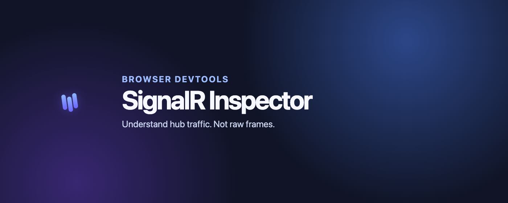
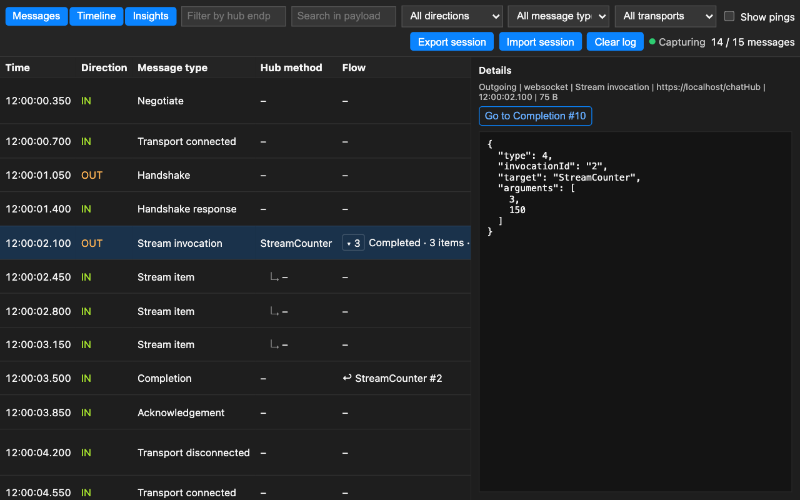
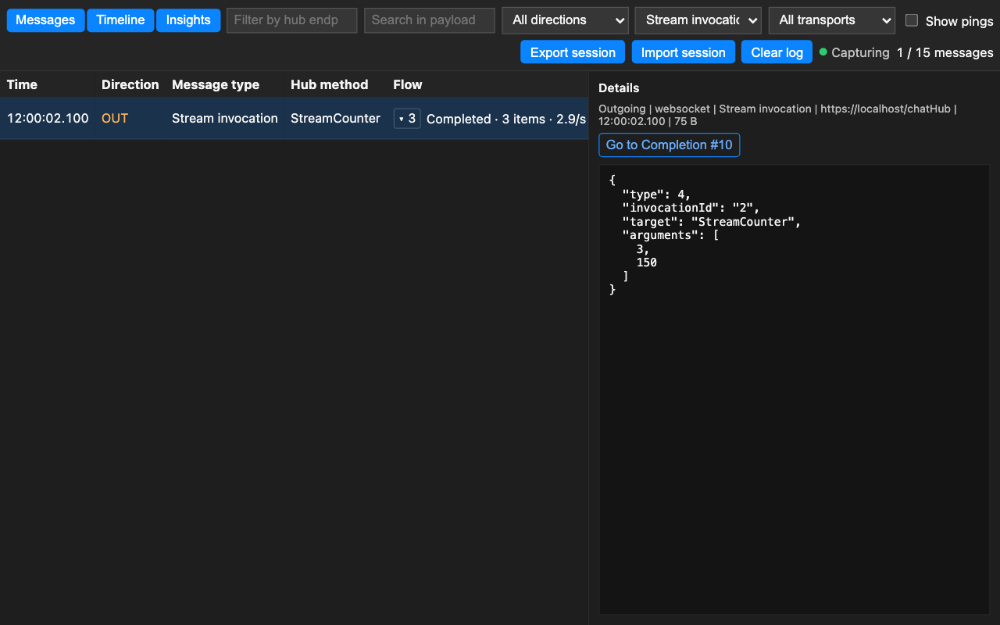
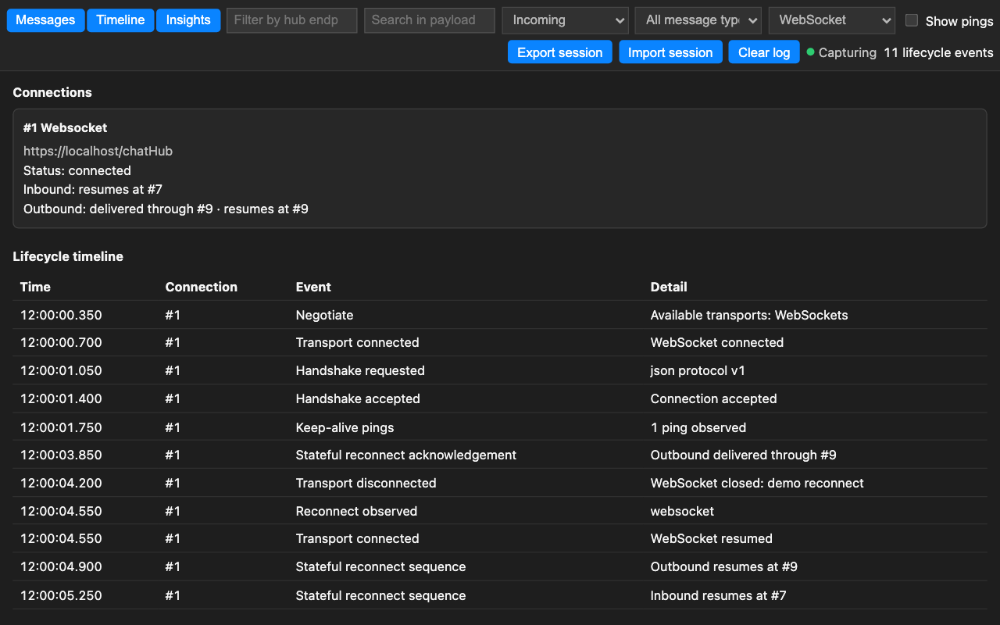
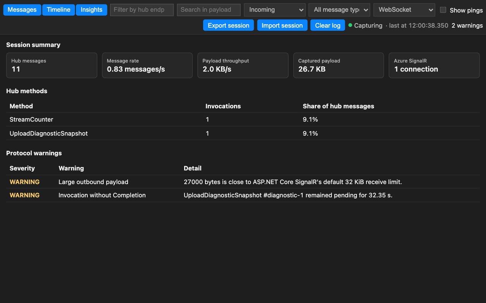

# How to Debug SignalR Traffic in Chrome and Edge with SignalR Inspector



This is the practical companion to *SignalR Is Not Just a WebSocket Frame*: that article explains
why the tool is built the way it is; this one shows how to use it.

Chrome DevTools shows you this:

```text
{"type":1,"invocationId":"42","target":"SendMessage","arguments":["Ada","Hello"]}\u001e
```

Your brain decodes it: `type: 1` is an invocation, `target` is the hub method,
`invocationId` links it to a completion that is somewhere below, possibly in another transport
frame and mixed with pings. Every single time.

SignalR Inspector is a free, MIT-licensed DevTools panel for Chrome and Edge that does the
decoding for ASP.NET Core SignalR — JSON and MessagePack over WebSockets, Server-Sent Events, and
Long Polling — and shows the conversation instead of the wire: invocations paired with completions,
streams grouped, and each connection's life story on a timeline. Nothing leaves your browser:
no telemetry, no host permissions, activation is per-tab.

This post is a tour of the debugging workflows it enables, using the sample application from
the repository.

## Install

- [Chrome Web Store](https://chromewebstore.google.com/detail/signalr-inspector/lgaffhilcepfgfiealbdadfedpdfnfla)
- [Microsoft Edge Add-ons](https://microsoftedge.microsoft.com/addons/detail/signalr-inspector/hlohgfgkniolajoidmnmahelkejeimnh)
- From source: clone [the repository](https://github.com/jakubgrzywaczewski/signalr-devtools),
  then load `signalr-inspector/` as an unpacked extension
  (`chrome://extensions` → Developer mode → *Load unpacked*).

To try it without your own app, run the bundled .NET 10 sample — no npm install; its single
NuGet dependency (the MessagePack hub protocol) restores automatically:

```bash
dotnet run --project samples/SignalR.Sample
```

and open `http://localhost:5141`. The page has four scenario buttons: **WebSockets (JSON)**,
**Long Polling (JSON)**, **Server-Sent Events (JSON)**, and **MessagePack (WebSockets)**.

## Step 1: Activate the tab, open the panel

Page-level instrumentation remains off until you ask for it. Click the extension's toolbar icon
on the tab you want to inspect: the icon gains an active badge and the tab reloads, so the SignalR
handshake is captured from the very first frame. Clicking the icon again deactivates it and reloads the page
clean — activation is a per-tab toggle.

Then open DevTools (`F12`) and pick the **SignalR Inspector** tab. You get three views:
**Messages**, **Timeline**, and **Insights**.



You do not have to guess whether capture is running: the panel shows a capture-state indicator
("Capturing · last at …" / "Not capturing"), and while the tab is not activated it displays an
onboarding banner that points you at the toolbar icon. If you only see DevTools-observed
network traffic (Long Polling, outgoing SSE posts) without activating the tab, the indicator
says so explicitly.

One workflow rule worth internalizing: **open DevTools before the connection starts** whenever
you care about Long Polling or the outgoing half of Server-Sent Events. Those transports are
observed through the read-only DevTools network API, which cannot see requests that finished
before the panel existed. WebSocket and incoming SSE traffic is captured at the page level, so
it does not have this constraint — but "activate, open DevTools, then connect" is the habit
that always works.

## "Which call failed, and how long did it take?"

Run the WebSockets (JSON) scenario and send a few messages. In **Messages**, each invocation
row carries a Flow label such as `Completed · 240 ms` or `Error · 1.3 s` — the panel pairs
invocations with their completions by connection, direction, and invocation ID, so the answer
sits inline instead of being three hundred rows away.

Select a row to open its details: parsed arguments, target, transport, and a
**Go to Completion #N** button that jumps straight to the paired response (and back). Errors show
the completion's error text next to the invocation that caused it.

## "What is all this noise?" — filters

The filter bar composes:

- text search over endpoint and payload,
- direction (incoming / outgoing),
- SignalR message type (Invocation, Completion, Stream item, …),
- transport (WebSocket, Server-Sent Events, Long Polling, negotiation).

Protocol keep-alive pings are hidden by default — tick *Show pings* when you actually want
them. A typical triage: filter to `Invocation` + outgoing to see what your app sent, then flip
to `Completion` + incoming to see what came back.



## "Is my stream healthy?"

The sample's `StreamCounter` scenario produces a real `StreamInvocation` with `StreamItem`
traffic. The panel groups the items under their invocation as a collapsible group with an item
count and the observed delivery rate, so a stalled or slow stream is visible at a glance
instead of being an endless scroll of rows.

## "Why did my connection drop at 14:32?" — Timeline

Switch to **Timeline** for the connection's life story: negotiate → transport open → handshake
→ keep-alives → reconnect → close, with close reasons and transport fallback made explicit.
Keep-alive pings are aggregated per connection into a count and median gap, so what you see is
the anomaly, not two hundred heartbeat rows. The sample has a controlled transport-drop button
precisely so you can watch a reconnect happen.

If the app uses .NET 8+ stateful reconnect, the acknowledgement and sequence messages are
visualized separately for each direction — and a resumed transport is merged back into the
interrupted connection, so you keep a single connection card and invocation pairing and stream
groups survive the drop instead of stranding on a duplicate card.



## MessagePack works too

Run the MessagePack (WebSockets) scenario. The binary frames are decoded like JSON ones — hub
message types, targets, arguments, 64-bit integers without silent precision loss — with
corrupt frames falling back to a raw Base64/hex view. The decoder is tested against golden
fixtures generated by the official ASP.NET Core SignalR implementation.

## "It happened on my machine" — session export

**Export session** writes the current log to a versioned JSON file; **Import session** restores
it — on another day, or in a teammate's browser, where Flow, Timeline, and Insights all work on
the imported data. Think HAR file, but for a SignalR conversation. Exports are bounded and
sanitized (connection tokens and extension identifiers never enter the file), though captured
application payloads are preserved — that is the point — so treat the file like any debugging
artifact.

## Insights: statistics and warnings

The **Insights** view derives, locally, from the same captured log: message and payload rates,
captured volume, an invocation distribution per hub method, and Azure SignalR connection count
(standard negotiation redirects get a badge; access tokens are discarded). Warnings fire in
four conservative, protocol-anchored situations: an outgoing payload near ASP.NET Core's
default 32 KiB receive limit, an invocation still missing its completion after 30 seconds of
subsequent traffic, a stream cut off by a closing connection (reported as an invocation without
completion), and keep-alive gaps anomalous relative to the connection's own observed rhythm
(with a 30-second fallback threshold before a rhythm exists).



## What it deliberately does not do

- No message injection or disconnect simulation — the tool is read-only by design.
- No page-level WebSocket or incoming SSE capture from iframes or Web Workers; HTTP traffic can
  still be visible to the DevTools network observer.
- Long Polling and outgoing SSE need DevTools open before negotiation (browser API constraint).
- Custom domains in front of Azure SignalR Service are not recognized.
- No telemetry, no persistence, no outbound network: captured data lives in memory (bounded to
  500 messages per tab), dies with the tab, and leaves the browser only via explicit export.

## Links

- Source, sample, and releases:
  [github.com/jakubgrzywaczewski/signalr-devtools](https://github.com/jakubgrzywaczewski/signalr-devtools)

Feedback is genuinely welcome — especially what is missing for your debugging workflow.
